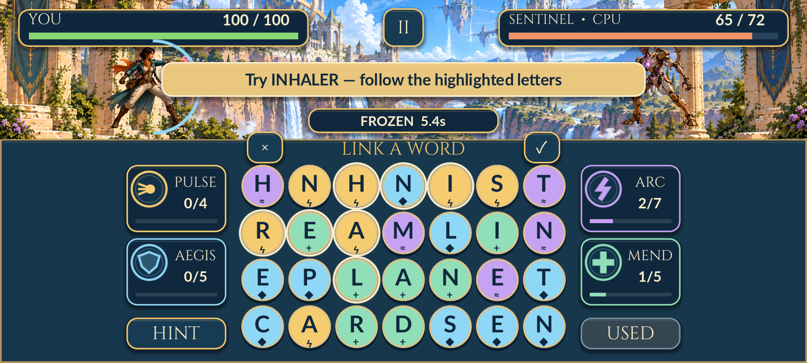
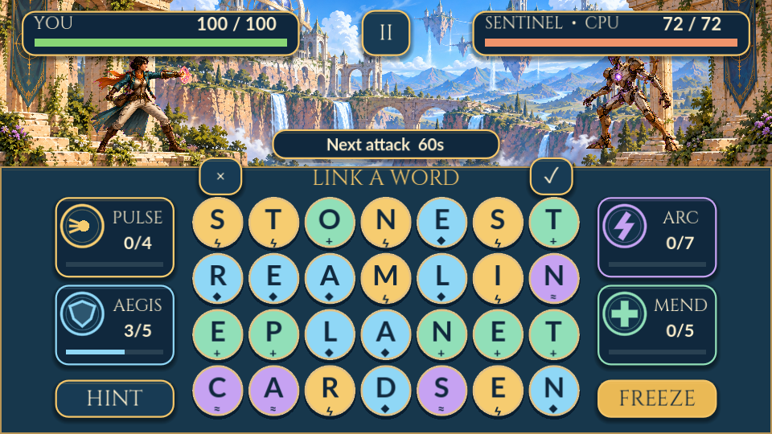

# Provere verzije 0.1.0

Datum: 2026-09-16. Projekat `game/`, Godot 4.7.2 standard. Rezultati se odnose na prvu igrivu kampanju, ne na završnu validaciju za Play Store.

## Automatske provere — 91 uspešna provera

`tools/build-android.ps1` uvozi projekat, izvršava `game/tests/test_game.gd` i prekida izvoz ako testovi ne prođu.

- Učitavanje 76.802 reči, uključujući običan i složeniji vokabular.
- Susedstvo/dijagonale bez prelaska kraja reda, povratak po putanji i brzo prevlačenje preko više polja.
- Trideset generisanih tabli sa više rešenja i proverljivim putanjama solver-a.
- STONE: prihvatanje, tačna šteta i energija po bojama; dopuna samo potrošenih polja; ponovljena reč odbijena.
- Štit, računarski napad, lečenje, prekid napada i jednokratni power-up.
- Validacija snimka i JSON round-trip, odbijanje neispravnih tipova, nastavak pauziranog duela sa istom tablom/power-upom.
- Nagrada samo jednom, otključavanje misije, cena i efekat unapređenja, ponovno učitavanje napretka i oporavak oštećenog JSON-a iz rezervne kopije.
- Završavanje misija 1, 4, 8 i 12 kroz stvarni solver, reči, sposobnosti i napade računara. Ovaj automatizovani igrač nije merenje ljudske težine ili tempa.

## Android integracija

Medium Phone API 36, x86_64, 2400 × 1080 landscape, emulator 35.4.9. Host OpenGL na NVIDIA RTX 4060; `-gpu host -feature -Vulkan -no-snapshot`. Instalacija sa `--no-incremental`.

Automatizovani test koristi **stvarne ADB dodire i prevlačenje kroz prikazanu aplikaciju**. Ne prepisuje stanje igre radi pobede. Save se samo čita da bi se proverili efekti. Test:

1. Pokreće novu igru i prolazi meni → kampanju → power-upove → pomoć → borbu.
2. Prevlačenjem sastavlja STONE, proverava štetu, dopunu table i upotrebu Freeze-a.
3. Zatvara proces aplikacije, ponovo pokreće i nastavlja isti duel; proverava da je pauziran i da se vreme ne troši dok čeka.
4. Aktivira napunjen Aegis kada boje prve reči daju dovoljno energije; prikazuje Hint.
5. Sastavlja daljnje reči pojedinačnim dodirima + ✓ i aktivira sposobnosti do pobede.
6. Proverava nagradu, sledeću otključanu misiju, kupovinu unapređenja i očuvanje svega posle još jednog restarta.
7. Pregleda log stvarnog Android procesa; nema GDScript grešaka ili fatalnog pada. Povremeno se pojavljuje Godot upozorenje o ponovnom kompajliranju shader keša, posle koga prikaz radi.

Skripta za ponavljanje: `tools/qa-android.cjs`, sa obaveznim izborom emulatora i `--reset-test-data`; postupak u [android.md](android.md). Lokalni detaljni logovi su u `.local/`, van Git-a.

## Vizuelna provera i paket

- Svih šest osnovnih ekrana renderovano u Godotu. Pregledani standardni 16:9 i široki mobilni prikazi, kao i Android pomoć/pauza/rezultat. Krupna slova, obojene sposobnosti sa simbolima, bez desktop menija ili browser okvira.
- 16:9 izvor koristi najmanje 854 × 480; širi telefon dobija dodatnu širinu uz istu visinu komandi. Provereni prikazi: 960 × 540, 1152 × 576 i Android 2400 × 1080.
- Rečnik se priprema u pozadinskoj niti uz ekran učitavanja. Brzo prevlačenje prati segment između događaja, pa sporiji frejm ne preskače susedna slova.
- APK potpisan i potpis verifikovan pri izvozu. Proveren Android manifest: paket `com.sinisamedic.warofwords`, verzija 0.1.0 / code 1, API 24 minimum / API 36 target, ARM64 + x86_64, samo dozvola VIBRATE.
- SHA256 tačnog distributivnog APK-a je u priloženom `WarOfWords-0.1.0-android.apk.sha256`; APK i hash se isporučuju kao GitHub release assets, ne kao izvorni Git fajlovi.

Snimci su direktni izlazi Godot/Android renderera, bez slikarske dorade. Slika 16:9 koristi razvojni screenshot režim sa zaustavljenim prikazom tajmera na 60 s; redovna borba koristi vremena iz dizajna igre. Android snimak je iz stvarnog testnog duela.

## Preostale granice

- Nije testirano na fizičkom Samsungu S23 Ultra. Treba proveriti osećaj dodira, čitljivost u ruci, stvarni zvuk/vibraciju, potrošnju baterije i ponašanje pri pozivu/zaključavanju. Emulator je radio bez izlaznog zvuka; postojanje i reprodukcija audio strimova provereni su u kodu/runtime-u, ne slušanjem na telefonu.
- Balans je početni. Sve misije koriste istog originalnog protivnika sa drugačijim imenima/statistikama i boss ritmom. Animacije su 2D pomeranje i efekti; nema skeletnih animacija, muzike, različitih arena po poglavlju ili sadržaja posle kampanje osim ponavljanja i unapređenja.
- Rečnik je pravopisni izvor, bez definicija i bez posebno uređene liste uvredljivih/retkih reči. Generator ubacuje poznate reči i zatim dopunjava nasumičnim frekventnim slovima; težinu treba proveriti sa ljudskim igračem.
- Čuvanje je samo lokalno; nema naloga ili sinhronizacije između telefona. Debug potpis je za probu; Play Store potpisivanje i objavljivanje nisu urađeni.

Raniji pokušaji na emulatoru sa SwiftShader-om nisu radili zbog ograničenja shader uniformi. Prelazak na host OpenGL omogućio je stvaran Android test. To nije prećutano kao uspešna provera na SwiftShader-u niti kao test fizičkog telefona.
