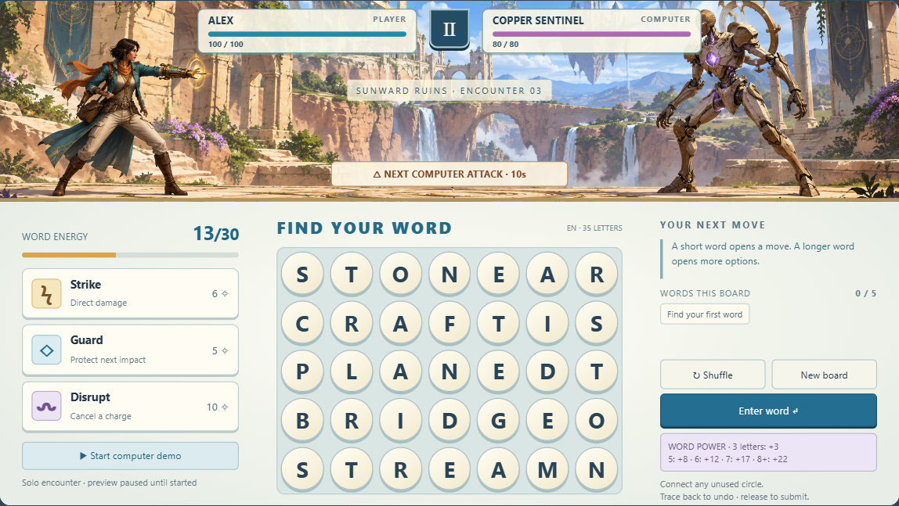

# War of Words — landscape atlas, revizija 02

**86 landscape ekrana i stanja, osam tokova. Engleski jezik, borba protiv računara, vedriji izgled za širu publiku.**

## Otvaranje

Otvoriti `index.html` dvoklikom u modernom browseru. Nije potreban server, instalacija, engine niti internet. Držati zajedno `index.html`, `style.css`, `screens.js`, `app.js` i folder `assets/`.

- **Explore screens:** pojedinačni ekrani i povezana stanja.
- **Atlas:** svi ekrani u landscape rasporedu.
- **Flows:** osam tokova kroz igru.
- **Focus view:** veći prikaz bez kataloga, koristan kada se telefon okrene vodoravno.
- Direktni ekrani: `index.html#battle`, `index.html#home`, `index.html#map`, `index.html#encounter`.

Na uspravnom telefonu prikazuje se umanjen pregled i savet za okretanje. To nije portrait verzija igre. Ovo je pregled artboard-a 1024 × 576; stvarne touch target veličine, safe-area i podrška za šire telefone zahtevaju test u budućem engine-u.

## Šta je promenjeno

- Landscape umesto portrait-a; arena sa igračem i računarom gore, velika tabla dole.
- **35 kružnih slova u mreži 7 × 5**, kao predlog broja. Istovremeno postoji mnogo mogućih reči, ne jedan zadati odgovor.
- **Engleski interfejs i engleska demo lista**, bez preostalog srpskog rečnika.
- Svetle kamene ruševine, plavo nebo, toplije pozadine, odrasla istraživačica i mehanički protivnik. Mali simpatični likovi zamenjeni su modulima sposobnosti.
- Duže reči daju više energije. Dodatni izazovi podstiču različite reči i širi vokabular.
- Prethodna 84 ekrana preuređena su u landscape; dodata su dva posebna detalja za Strike i Disrupt. Stara verzija ostaje u Git istoriji na `40c1588`.

## Interaktivna proba

1. U borbi prevući preko **S → T → O → N → E** u prvom redu i pustiti: **+8 energije**. Alternativa: klik/tap svakog kruga, pa **Enter word**. Tastatura: Tab i Enter.
2. **Start computer demo** pokreće predvidljivog protivnika koji najavljuje i izvodi udar. Nema ljudskog protivnika.
3. Strike troši 6 i pravi 14 štete. Guard troši 5 i ublažava sledeći pogodak za 8. Disrupt troši 10 i prekida najavu; oporavak traje 15 sekundi tokom aktivne simulacije.
4. Probati CRAFT, PLANE, BRIDGE, STREAM, PLANET ili **STREAMLINE**. Bilo koja dva kruga mogu da se povežu; svaki krug jednom po reči. Nema pravila susedstva u ovoj hipotezi.
5. Ista reč ne donosi ponovo energiju na istoj tabli. Posle pet različitih reči menja se tabla. Mešanje čuva istoriju reči. Broj pet i način zamene su predlozi.
6. Povratak preko prethodnog kruga briše poslednje slovo. Escape otkazuje unos; OS prekid dodira ne šalje polovičnu reč.
7. Pauza i povratak čuvaju demo borbu; prelazak na drugi ekran kataloga otvara nezavisan primer. Trening nema protivničke udare.

## Šta jeste i nije potvrđeno

**Potvrđeno od korisnika:** landscape, engleski za prvu verziju, računar kao protivnik, mnogo slova, više mogućih reči, vedriji izgled i publika koja uključuje odrasle.

**Predlog:** baš 35 slova, slobodno povezivanje, pet reči po tabli, svi brojevi, tempo, tema Sunward Ruins, imena i moduli. Engine i produkcioni engleski rečnik nisu izabrani.

## Granice

- Ovo je interaktivni mockup sa jednostavnom skriptovanom simulacijom. Nije implementacija pune igre.
- Demo ima **600 engleskih zapisa**. Po broju ponuđenih slova 584 su ostvariva na obe table. Nema produkcionog generatora, pune morfologije ni kompletne provere svih engleskih reči.
- Boss faza, napredovanje, ekonomija, zadaci, cloud i nagrade su ilustrativni prikazi. Simulacija CPU-a demonstrira osnovni napad, ne kompletan boss obrazac.
- Nema trajnog čuvanja, naloga, telemetrije, slanja prijava, plaćanja ili mrežnog rečnika. Osvežavanje stranice resetuje demo.
- Neki tekstualni meniji imaju skrol unutar panela; borba se vidi cela bez skrolovanja.
- Duži niz može fizički preseći druge krugove. Za proveru željene reči bez presecanja koristi tapkanje. Slobodno povezivanje naspram susedstva treba potvrditi.

## Materijali

[Poreklo grafike i tačan prompt](assets/README.md). Arena je originalan AI koncept, generisan ugrađenim ImageGen alatom. Nijedan lik ili kadar iz priložene reference nije kopiran u fajlove projekta. UI je autorski HTML/CSS, bez eksternih fontova ili biblioteka. `preview.png` je lokalni snimak našeg mockupa.

## Provere

Testni izveštaj za reviziju 02 sažet je u `STATUS.md`. Lokalni QA skript i snimci nalaze se u ignorisanom `.local/landscape-review/`; sadrže putanju runtime-a ovog računara i ne prenose se GitHub-om. Proveravati prikaz u desktop browseru i na realnom landscape telefonu pre odluke o veličini table.
